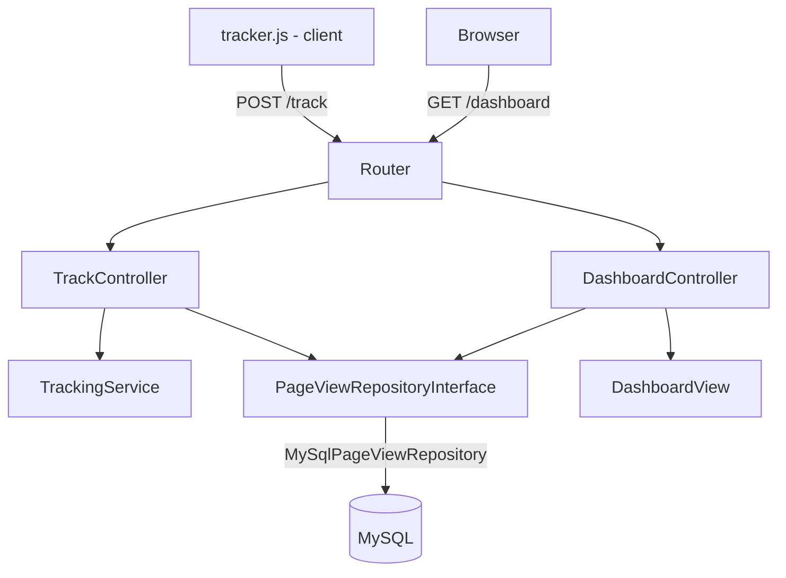

# Website Traffic Tracker

A simple website traffic tracker built progressively as a learning/portfolio project.

## Status

✅ Complete - built phase by phase, with commit history reflecting each stage of development.

## Tech Stack

- PHP 8.2
- MySQL 8.0
- Docker & Docker Compose

## Architesture



**Layers:**

- **Router** - single entry point, dispatches requests by path, centralizes error handling
- **Controller** - reads the HTTP request, calls the appropriate service/repository,returns a response
- **Service** - business logic (e.g. visitor ID resolution, URL normalization), independent of HTML
- **Repository** - database access, behind an interface so the concrete implementation (MySQL) can be swapped
- **View** - renders HTML from data, kept separate from controller
- **Container** - a small reflection-based dependency injection container that wires everything together

## Local Setup

```bash
docker-compose up -d --build
```

- App: http://localhost:8080
- phpmyadmin: http://localhost:8081

Both the main (`traffic_tracker`) and test (`traffic_tracker_test`) databases, along with their schema, are created automatically on first startup.

### Running tests

```bash
docker exec traffic-tracker-app phpunit --colors=always
```

## HTTPS / Cookie Testing

The `SameSite=None; Secure` cookie configuration was verified against a real HTTPS tunnel (via ngrok), not just localhost - confirming that the visitor-tracking cookie is correctly set and persisted across requests under real-world HTTPS conditions.

## Development Phase

- [x] Phase -1: Docker environment
- [x] Phase 0: Project setup
- [x] Phase 1: Naive working version
- [x] Phase 2: Separation of concerns (Router, Controller, Service, Repository)
- [x] Phase 3: DI container
- [x] Phase 4: Tests
- [x] Phase 5: Polish
